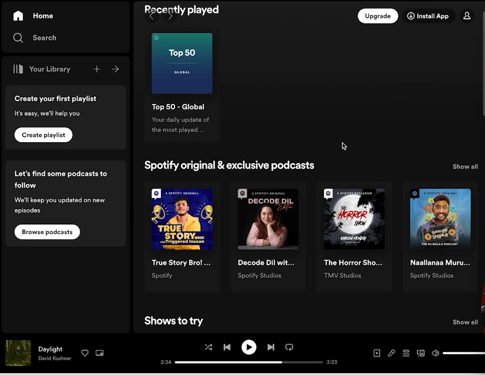

# Spotify Clone

A front-end clone of the Spotify web interface, built using HTML and CSS. This project focuses on replicating the visual layout and user interface of the popular music streaming service.



## 🌟 Features

- **Responsive Design**: The layout adapts to different screen sizes.
- **Left Navigation Sidebar**: Replicates the "Home," "Search," and "Your Library" sections.
- **Main Content Area**: Displays "Recently played" and "Podcasts" sections.
- **Music Player Bar**: A persistent player at the bottom with track information and controls.
- **Styling**: Uses modern CSS techniques to achieve a dark theme and clean, minimalist design.

## 🚀 Technologies Used

- **HTML5**: For the basic structure and content of the web page.
- **CSS3**: For all the styling, including flexbox and grid for layout, and custom fonts.

## 🛠️ How to Run

1. **Clone the repository**:
   ```bash
   git clone [https://github.com/mridulchourasia1/Frontend-Projects.git]

 * Navigate to the project directory:
   cd spotify-clone

 * Open index.html:
   Simply open the index.html file in your web browser. There's no need for a local server since this is a static site.
📝 Learning Points
This project was a great opportunity to practice and reinforce my skills in:
 * Semantic HTML: Using appropriate tags like <header>, <nav>, <aside>, <main>, and <footer> to create a well-structured document.
 * CSS Layout: Mastering Flexbox and CSS Grid for building complex and responsive layouts.
 * Styling with CSS: Using properties like box-shadow, border-radius, and background-image to create a visually appealing interface.
 * Component-based thinking: Breaking down the UI into smaller, manageable components (e.g., sidebar, player, card).
🤝 Contributing
This is a personal project, but feel free to fork the repository, make improvements, and submit a pull request!
 * Fork the Project
 * Create your Feature Branch (git checkout -b feature/AmazingFeature)
 * Commit your Changes (git commit -m 'Add some AmazingFeature')
 * Push to the Branch (git push origin feature/AmazingFeature)
 * Open a Pull Request
👤 Author
 * Mridul Chourasia - [GitHub] (https://www.github.com/mridulchourasia1)
📄 License
This project is open-source and available under the MIT License.
Disclaimer: This is a personal project for educational purposes and is not affiliated with or endorsed by Spotify. All trademarks and registered trademarks are the property of their respective owners.